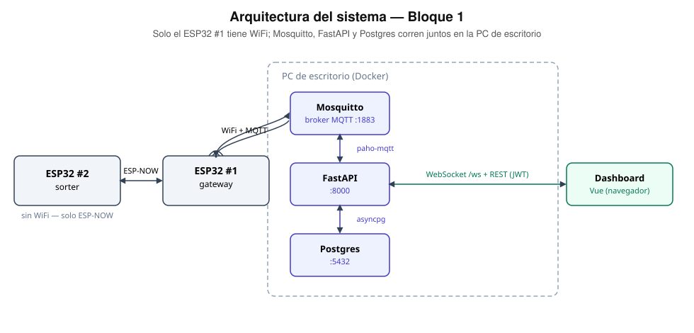

# Arquitectura

Solo el **ESP32 #1 (gateway)** tiene WiFi. El **ESP32 #2 (sorter)** habla
únicamente por ESP-NOW — nunca se conecta a ningún punto de acceso — y todo
lo que produce (estado de la puerta, y en el Bloque 2 los eventos de caja)
llega al servidor pasando siempre por el gateway.

El sorter nunca toca la red: todo pasa por el gateway. Mosquitto, FastAPI y
Postgres corren juntos en la PC de escritorio (docker-compose); el
dashboard es la única pieza que corre en el navegador.

## Por qué solo el gateway tiene WiFi

Tener un único punto de entrada a la red simplifica la seguridad del sorter
(no hay superficie de ataque WiFi en la placa que mueve motores y servos) y
evita el problema de que dos radios WiFi compitan por el mismo canal. A
cambio, el sorter necesita **sincronizar su canal ESP-NOW con el del
gateway sin conocerlo de antemano** — ver la sección de riesgos en
[`conexiones-esp32-sorter.md`](./conexiones-esp32-sorter.md).

## Dónde corre cada cosa

| Pieza | Dónde | Por qué |
|---|---|---|
| Mosquitto, FastAPI, Postgres | PC de escritorio (Docker) | Es la máquina rápida; el ESP32 le llega por IP local en la misma red WiFi |
| Firmware de los 2 ESP32 | Se compilan/flashean desde la laptop | Solo hace falta el puerto USB al flashear, no potencia de cómputo |
| Dashboard | Navegador, apuntando a la PC de escritorio | Es una SPA que solo necesita HTTP/WebSocket |

Los túneles de VS Code **no sirven para el MQTT** (son proxies HTTP, no TCP
crudo); si hiciera falta exponer algo hacia afuera, es el dashboard/API, no
el broker. Más detalle en `server/.env.example`.

## Ver también

- [`servidor.md`](./servidor.md) — estructura de `server/`, cómo correrlo, endpoints
- [`dashboard.md`](./dashboard.md) — estructura de `dashboard/`, cómo correrlo
- [`conexiones-esp32-gateway.md`](./conexiones-esp32-gateway.md) — cableado del ESP32 #1
- [`conexiones-esp32-sorter.md`](./conexiones-esp32-sorter.md) — cableado del ESP32 #2
- [`protocolo.md`](./protocolo.md) — structs de ESP-NOW y topics de MQTT, con ejemplos de payload
