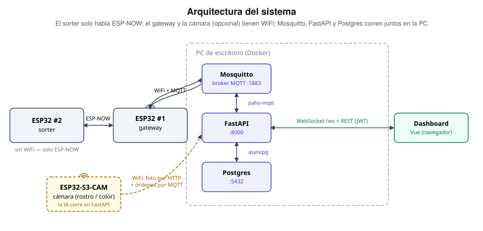

# Arquitectura

De los dos ESP32 del sistema, solo el **ESP32 #1 (gateway)** tiene WiFi. El
**ESP32 #2 (sorter)** habla únicamente por ESP-NOW — nunca se conecta a
ningún punto de acceso — y todo lo que produce (estado de la puerta, y en el
Bloque 2 los eventos de caja) llega al servidor pasando siempre por el
gateway. La **ESP32-S3-CAM** es un tercer nodo opcional con WiFi propio (ver
más abajo).

La **cámara** (ESP32-S3-CAM, un tercer nodo) sí se conecta a WiFi por su
cuenta: manda fotos de 30–50 KB por HTTP, que ni ESP-NOW ni el buffer MQTT
de las placas pueden llevar, y como no mueve motores el argumento de
seguridad de abajo no le aplica. Tiene dos versiones que se eligen con
variables del servidor (ver [`camara-rostro.md`](./camara-rostro.md) y
[`camara-color.md`](./camara-color.md)); la IA corre en la PC, no en las
placas.

El sorter nunca toca la red: todo pasa por el gateway. Mosquitto, FastAPI y
Postgres corren juntos en la PC de escritorio (docker-compose); el
dashboard es la única pieza que corre en el navegador.

## Por qué solo el gateway tiene WiFi

Tener un único punto de entrada a la red simplifica la seguridad del sorter
(no hay superficie de ataque WiFi en la placa que mueve motores y servos) y
evita el problema de que dos radios WiFi compitan por el mismo canal. A
cambio, el sorter necesita **sincronizar su canal ESP-NOW con el del
gateway sin conocerlo de antemano** — ver la sección de riesgos en
[`conexiones-esp32-sorter.md`](./conexiones-esp32-sorter.md).

## Dónde corre cada cosa

| Pieza                        | Dónde                                      | Por qué                                                                   |
| ---------------------------- | ------------------------------------------ | ------------------------------------------------------------------------- |
| Mosquitto, FastAPI, Postgres | PC de escritorio (Docker)                  | Es la máquina rápida; el ESP32 le llega por IP local en la misma red WiFi |
| Firmware de los 2 ESP32      | Se compilan/flashean desde la laptop       | Solo hace falta el puerto USB al flashear, no potencia de cómputo         |
| Dashboard                    | Navegador, apuntando a la PC de escritorio | Es una SPA que solo necesita HTTP/WebSocket                               |
| IA de la cámara              | Dentro del servidor FastAPI                | OpenCV (rostro) y scikit-learn (color): livianos, corren en CPU sin GPU   |
| Firmware de la cámara        | Se flashea desde la laptop                 | Igual que los otros dos ESP32                                             |

**Red de la demo.** Todo puede correr en una sola laptop con el hotspot del
celular como red (2.4 GHz: los ESP32 no ven redes de 5 GHz): la laptop corre
Docker, FastAPI y el dashboard, y los tres ESP32 se conectan a ese mismo
hotspot. Así la demo no depende del internet de la facultad.

Los túneles de VS Code **no sirven para el MQTT** (son proxies HTTP, no TCP
crudo); si hiciera falta exponer algo hacia afuera, es el dashboard/API, no
el broker. Más detalle en `server/.env.example`.

## Ver también

- [`servidor.md`](./servidor.md) — estructura de `server/`, cómo correrlo, endpoints
- [`dashboard.md`](./dashboard.md) — estructura de `dashboard/`, cómo correrlo
- [`conexiones-esp32-gateway.md`](./conexiones-esp32-gateway.md) — cableado del ESP32 #1
- [`conexiones-esp32-sorter.md`](./conexiones-esp32-sorter.md) — cableado del ESP32 #2
- [`camara-rostro.md`](./camara-rostro.md) — cámara, versión A: login por PIN + rostro
- [`camara-color.md`](./camara-color.md) — cámara, versión B: color de las cajas en paralelo al sensor
- [`protocolo.md`](./protocolo.md) — structs de ESP-NOW y topics de MQTT, con ejemplos de payload
