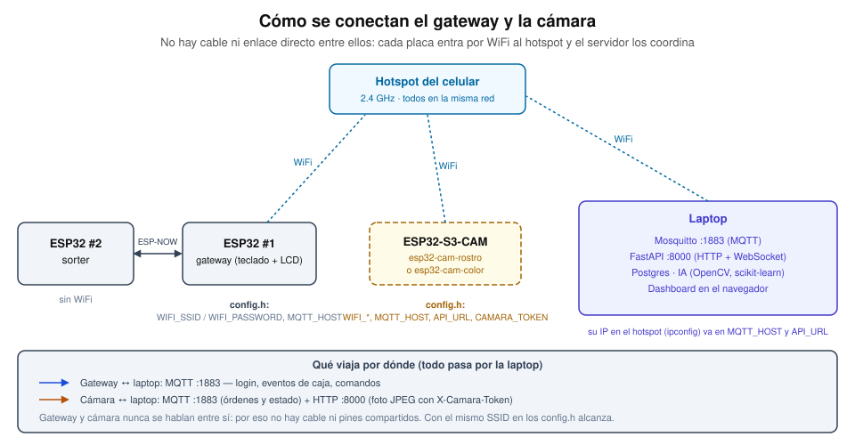
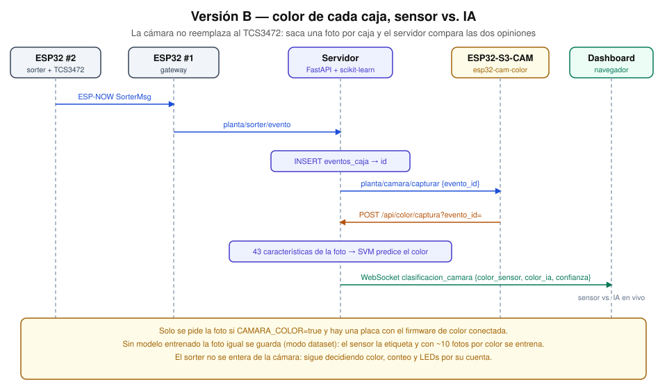
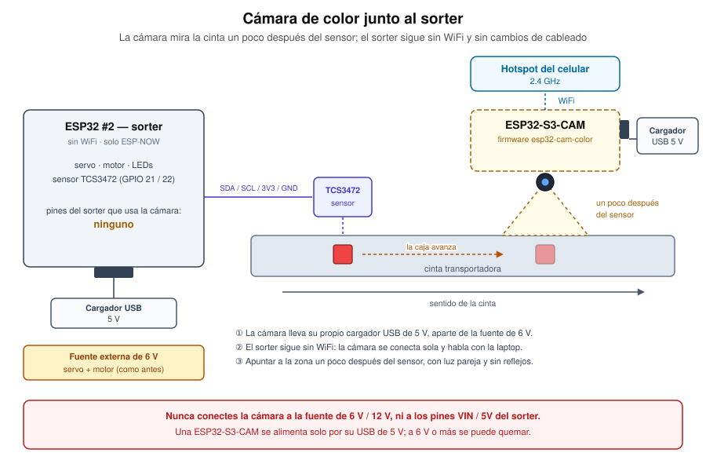
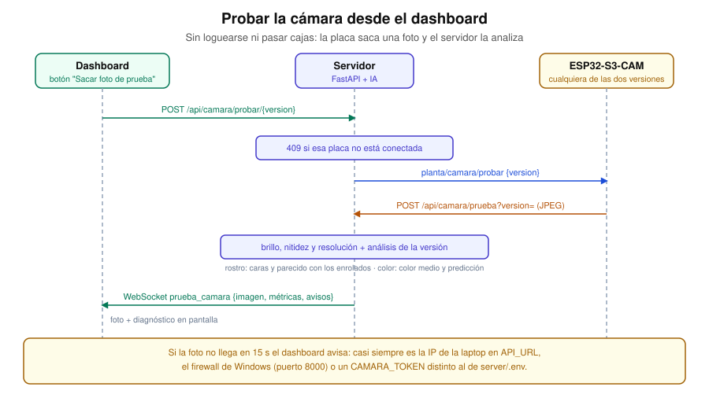

# Cámara con IA — versión B: color de las cajas

La ESP32-S3-CAM mira la cinta y **clasifica el color de cada caja en paralelo
al sensor TCS3472**. No lo reemplaza: el sorter sigue decidiendo color,
conteo y LEDs exactamente igual. La cámara aporta una segunda opinión y el
dashboard compara las dos en vivo.

Con `CAMARA_COLOR=false` (el valor por defecto) el sistema se comporta como
antes de tener cámara.

## Cómo se conecta con el gateway

**No se conecta directamente**: no hay cable, pines compartidos ni enlace
ESP-NOW entre la cámara y el gateway. Cada placa entra por WiFi a la misma red
(el hotspot del celular, 2.4 GHz) y hablan con la laptop, que las coordina.
Para el color, el sorter le pasa cada caja al gateway por ESP-NOW, el gateway
la sube por MQTT y el servidor le pide la foto a la cámara.



Para que funcione, en los `config.h` de **las dos placas** (gateway y cámara)
va el mismo `WIFI_SSID` / `WIFI_PASSWORD`, y `MQTT_HOST` con la IP de la laptop
en ese hotspot (`ipconfig`). La cámara además lleva `API_URL`
(`http://<esa IP>:8000`) y un `CAMARA_TOKEN` igual al de `server/.env`. En
Windows, el firewall tiene que dejar entrar los puertos 1883 (MQTT) y 8000
(API).

## Cómo funciona



1. El sensor detecta una caja y el evento llega al servidor por el camino de
   siempre. Ahora el servidor conserva el `id` de la fila y, con
   `CAMARA_COLOR=true` y la cámara conectada, publica `planta/camara/capturar` con ese `evento_id`.
2. La cámara saca una foto y la sube por HTTP. El `evento_id` une la foto con
   la caja exacta: no hay que emparejar por hora.
3. El servidor guarda la foto, calcula sus características y, si ya hay un
   modelo entrenado, predice el color. Guarda el resultado en
   `capturas_camara` (y en la columna `color_ml` de `eventos_caja`, que
   estaba reservada para esto) y lo retransmite por WebSocket.

## Si la cámara no está conectada

El servidor solo pide fotos si `CAMARA_COLOR=true` **y** hay una placa con
el firmware de color conectada (cada firmware se anuncia por MQTT, ver
[`camara-rostro.md`](./camara-rostro.md#si-la-camara-no-esta-conectada)). Si
cambiás el firmware de la placa o la apagás, el sorter y el dashboard siguen
funcionando igual; solo dejan de llegar fotos, y si se cae con el flag
activado queda una alerta `camara_offline`. Con las dos placas
(una por versión) las dos versiones pueden funcionar a la vez.

## Con webcam USB

Igual que en rostro ([detalle completo en `camara-rostro.md`](./camara-rostro.md#con-webcam-usb-en-vez-de-la-esp32-cam)):
con `COLOR_WEBCAM=true` el servidor saca la foto él mismo apenas llega el
evento del sorter, sin ida y vuelta por MQTT a una placa — menos latencia,
la caja se movió menos entre que el sensor la vio y se saca la foto. Si
`ROSTRO_WEBCAM` y `COLOR_WEBCAM` están las dos en `true`, comparten **la
misma webcam** (`WEBCAM_INDICE`): hay que ubicarla según qué se esté
demostrando en cada momento (el cable USB largo lo permite).

## La IA: scikit-learn, entrenada con tus propias fotos

No hay dataset externo: **el sensor etiqueta solo las fotos**. Cada caja que
pasa deja una foto con la etiqueta que dijo el TCS3472 (o la que corrijas a
mano en `eventos_caja.etiqueta_real`, que tiene prioridad). Cuando hay
suficientes, se entrena un modelo con esas fotos.

- **Características** (43 números por foto, en `server/app/color_ia.py`):
  histograma HSV, matiz medio de los píxeles saturados, saturación y brillo
  medios, y color RGB medio y mediano. Solo mira el centro de la imagen
  (`COLOR_RECORTE`, 60 % por defecto), donde queda la caja.
- **Modelo**: SVM con kernel RBF (`sklearn.svm.SVC`), que además da la
  probabilidad de cada color — la "confianza" que se ve en el dashboard.
- **Evaluación honesta**: se separa 20 % de las fotos (estratificado) que el
  modelo no ve al entrenar, y sobre ese 20 % se calculan la accuracy y la
  matriz de confusión. El modelo que queda guardado se reentrena después con
  todas las fotos.
- Corre en la laptop en CPU, sin torch ni GPU: entrenar con cientos de fotos
  tarda segundos y clasificar una foto unos pocos milisegundos.

Dos decisiones que salieron de medir, no de suponer: el modelo **no usa
`StandardScaler`** (sobre histogramas con bins casi vacíos amplifica el ruido
y con pocas fotos bajaba la accuracy de ~100 % a ~75 % en pruebas con imágenes
sintéticas), y se piden **al menos 10 fotos por color** (con menos, ni el
split ni la calibración de probabilidades son confiables).

### Modo "juntar dataset"

Mientras no haya modelo, la cámara igual saca y guarda las fotos, y el
dashboard muestra cuántas hay de cada color. Es el modo de las primeras
pasadas de cajas.

## Puesta en marcha

1. **Dependencias** del servidor (opencv, scikit-learn):
   `.venv/Scripts/pip install -r requirements.txt`.
2. **Migración** (si el volumen de Postgres ya existía):
   ```bash
   docker compose exec -T postgres psql -U planta -d planta -f /docker-entrypoint-initdb.d/04-color-camara.sql
   ```
   En Git Bash de Windows anteponer `MSYS_NO_PATHCONV=1` al comando, o usar
   PowerShell: si no, Git Bash reescribe la ruta del contenedor.
3. **Servidor**: en `server/.env` poner `CAMARA_TOKEN=...` y
   `CAMARA_COLOR=true`, y reiniciar `uvicorn`.
4. **Firmware**: en `firmware/esp32-cam-color/` copiar
   `include/config.h.example` a `include/config.h`, completar WiFi (hotspot,
   2.4 GHz), IP de la laptop y el mismo `CAMARA_TOKEN`; después
   `pio run -t upload`.
5. **Juntar fotos**: con la cinta en `low`, pasar cajas de los 3 colores
   (mínimo 10 de cada una, mejor 30+) con la iluminación de la demo.
6. **Entrenar**: botón "Entrenar con el dataset" en `/camara-color`, o desde
   la terminal `.venv/Scripts/python ml/entrenar_color.py`, que imprime las
   métricas. El servidor usa el modelo nuevo enseguida, sin reiniciar.
7. **Seguir pasando cajas**: el dashboard muestra el acuerdo entre sensor e IA
   caja por caja.

## Montaje



La cámara va **sobre la cinta, apuntando a la zona donde queda la caja un
poco después del sensor de color**: entre que el TCS3472 la detecta, el
evento viaja por ESP-NOW y MQTT y llega la orden a la placa, la cinta ya la
movió unos centímetros. Con la cinta en `low` la foto de la latencia
completa (orden → foto) se imprime por el monitor serie para calibrar.

Lo que más pesa en la precisión es la **iluminación pareja y constante**: la
misma luz al juntar las fotos y al usarlo, sin reflejos directos sobre las
cajas. Si cambia la luz del aula, conviene juntar unas fotos más y
reentrenar.

## Probar la cámara

Antes de usarla de verdad conviene comprobar que la placa, el lente y la luz
andan. No hace falta loguearse ni pasar cajas: el dashboard tiene un botón.



1. **Monitor serie** (`pio device monitor`, 115200) al arrancar. Tiene que
   verse: `PSRAM: ... bytes` (si dice 0, cambiar `memory_type` en
   `platformio.ini`), `Camara OK, sensor PID=0x3660` (es el OV3660; el
   OV2640 sería `0x2642`), `WiFi OK, IP ...` y `MQTT OK`.
2. **Dashboard**: en la pantalla **Cámara**, tarjeta **"Probar la cámara"** →
   "Sacar foto de prueba" (con `COLOR_WEBCAM=true` no hace falta placa
   conectada). El botón **"Vista previa en vivo"** repite el pedido cada 2s
   para encuadrar y enfocar sin apretarlo una y otra vez — no es streaming
   real, se apaga sola si la cámara se desconecta.
3. **Qué mirar**:
   - La **imagen**: si sale al revés o espejada, `CAM_VFLIP` / `CAM_HMIRROR`
     en `config.h`; y que el encuadre sea el del montaje.
   - **Brillo** (0–255) y **nitidez**: avisa si la foto queda muy oscura,
     sobreexpuesta o desenfocada. Son umbrales orientativos.
   - El **color medio** de la zona central (lo que "ve" el clasificador) y, si
     ya hay un modelo entrenado, **lo que predice**. Sirve para comprobar el
     encuadre: la caja tiene que quedar en el centro de la foto.
4. Si no llega nada en 15 s, el dashboard lo avisa. Casi siempre es la IP de
   la laptop en `API_URL`, el firewall de Windows (puerto 8000) o un
   `CAMARA_TOKEN` distinto al de `server/.env`; el monitor serie muestra el
   código HTTP de cada intento.

La última foto de prueba queda guardada en `server/capturas/prueba/`.

## Problemas comunes

- **"Hacen falta al menos 2 colores con 10 fotos cada uno"**: todavía no
  alcanza el dataset. El dashboard muestra cuántas hay de cada color.
- **Mucha diferencia entre sensor e IA con un color puntual**: mirar la
  matriz de confusión (qué color confunde con cuál) y las fotos de esos
  casos; casi siempre es luz o encuadre. Si el que se equivoca es el sensor,
  corregir `etiqueta_real` y reentrenar.
- **La foto llega tarde y la caja ya salió del cuadro**: acercar el encuadre a
  la posición del sensor o bajar la velocidad de la cinta.
- **`esp_camera_init fallo`, imagen invertida, HTTP -1/401**: ver los
  problemas comunes de [`camara-rostro.md`](./camara-rostro.md#problemas-comunes),
  son los mismos (pinout, PSRAM, `CAM_VFLIP`, IP/firewall/token).

## Ver también

- [`protocolo.md`](./protocolo.md) — topic y endpoints nuevos
- [`servidor.md`](./servidor.md) — endpoints `/api/color/*`
- [`camara-rostro.md`](./camara-rostro.md) — la otra versión de la cámara
