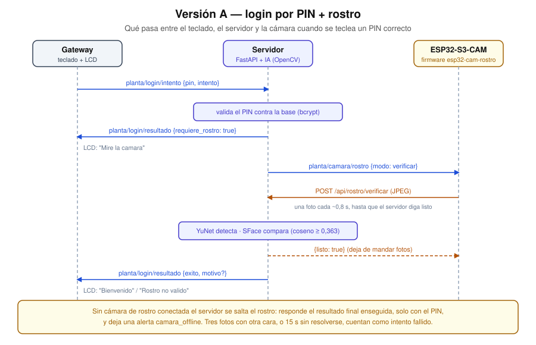
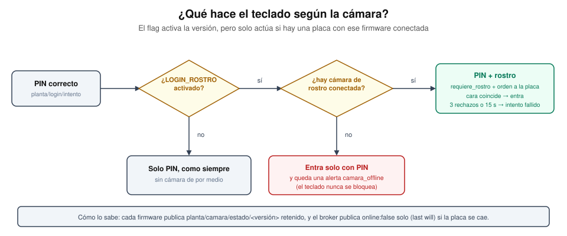
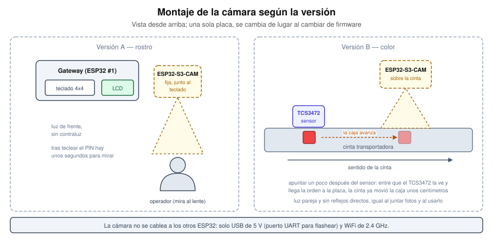

# Cámara con IA — versión A: PIN + rostro

La ESP32-S3-CAM se suma al login del teclado como **segundo factor**: primero
el PIN (igual que siempre) y después la cara, que tiene que ser del mismo
usuario. El PIN sigue siendo el secreto compartido con la web que pidió el
docente; el rostro es un extra que se prende con `LOGIN_ROSTRO=true`.

Con la variable en `false` (el valor por defecto) el sistema se comporta
exactamente como antes de tener cámara.

## Cómo funciona



1. El gateway publica el PIN como siempre. El servidor lo valida contra la
   base.
2. Si el PIN es correcto y hay login por rostro, el servidor **no** responde
   éxito todavía: manda `requiere_rostro` (el LCD muestra "Mire la camara") y
   le ordena a la cámara verificar a ese usuario.
3. La cámara manda una foto cada ~0,8 s hasta que el servidor le dice que
   terminó (`{"listo": true}`) o pasan 13 s.
4. El servidor detecta la cara (**YuNet**), calcula su vector de 128 números
   (**SFace**) y lo compara por similitud coseno contra las muestras
   enroladas de ese usuario. Con similitud ≥ umbral (0,363) el login es
   exitoso.
5. Una foto sin cara no cuenta. Tres fotos con cara que no coincide, o 15 s
   sin resolverse, cierran el intento como fallido.

Un intento fallido por rostro cuenta igual que uno fallido por PIN: el
segundo seguido bloquea y levanta la alerta `login_bloqueado`. En
`intentos_login` queda con origen `keypad_rostro`.

## Si la cámara no está conectada

Cambiar de firmware en la placa (o apagarla) no puede dejarte sin acceso al
teclado, así que el servidor no confía solo en el flag. Cada firmware de
cámara, al conectarse a MQTT, publica un saludo **retenido**
(`planta/camara/estado/rostro` o `.../color`) y deja un _last will_: si la
placa se cae, el broker publica solo `online: false`. Con eso el servidor
sabe qué versión hay conectada de verdad:



| `LOGIN_ROSTRO` | Placa con firmware de rostro                  | El teclado hace                                            |
| -------------- | --------------------------------------------- | ---------------------------------------------------------- |
| `false`        | cualquiera                                    | Solo PIN, como siempre                                     |
| `true`         | conectada                                     | PIN + rostro                                               |
| `true`         | **no** conectada (o con el firmware de color) | Entra **solo con PIN** y queda una alerta `camara_offline` |

El costo es que el segundo factor se puede saltear desconectando la cámara:
es una decisión de laboratorio, para que un cable suelto no te deje afuera el
día de la demo. Si algún día hiciera falta lo contrario (bloquear sin
cámara), el cambio es una línea en `_manejar_login_intento`
([`mqtt_client.py`](../server/app/mqtt_client.py)).

El dashboard usa el mismo estado (`GET /api/camara/config`): las pantallas
Rostro y Cámara aparecen en el menú solo si su versión está activada o hay una
placa conectada (con un punto verde/gris de estado), y "Enrolar" se deshabilita
sin cámara.

## Por qué la foto va por HTTP y no por MQTT o ESP-NOW

Una foto VGA pesa 30–50 KB. ESP-NOW admite 250 bytes por paquete y el buffer
de PubSubClient es de 256 bytes. HTTP resuelve el tamaño sin trucos, y la
placa ya necesita WiFi de todos modos. Por esa misma razón la cámara es un
**tercer nodo con WiFi propio**, a diferencia del sorter (que no se conecta
a ninguna red): no mueve motores, así que el argumento de seguridad de
[`arquitectura.md`](./arquitectura.md) no le aplica.

## La IA

Los dos modelos son de [OpenCV Zoo](https://github.com/opencv/opencv_zoo) y
corren en la laptop con OpenCV, **sin torch y sin GPU**:

| Modelo        | Para qué                                      | Tamaño |
| ------------- | --------------------------------------------- | ------ |
| YuNet 2023mar | Detectar la cara y sus 5 puntos de referencia | 0,2 MB |
| SFace 2021dec | Convertir la cara alineada en un embedding    | 38 MB  |

En pruebas con imágenes de muestra: misma persona con otra foto → similitud
0,92; personas distintas → 0,13; el umbral recomendado por OpenCV es 0,363.
La inferencia tarda unos 50 ms por foto en CPU.

Se guarda el **embedding**, no la foto, como dato de comparación. La foto de
cada enrolamiento y de cada verificación se guarda en `server/capturas/rostro/`
solo como evidencia para el dashboard.

## Puesta en marcha

1. **Modelos** (una vez, con internet):
   ```bash
   cd server
   .venv/Scripts/pip install -r requirements.txt
   .venv/Scripts/python ml/descargar_modelos.py
   ```
2. **Migración** (si el volumen de Postgres ya existía):
   ```bash
   docker compose exec -T postgres psql -U planta -d planta -f /docker-entrypoint-initdb.d/03-rostro.sql
   ```
   Si recreás el volumen desde cero no hace falta: se aplica sola.
3. **Servidor**: copiar el token a `server/.env` (`CAMARA_TOKEN`) y reiniciar
   `uvicorn`.
4. **Firmware**: en `firmware/esp32-cam-rostro/` copiar
   `include/config.h.example` a `include/config.h`, completar WiFi (el hotspot,
   2.4 GHz), la IP de la laptop y el mismo `CAMARA_TOKEN`; después
   `pio run -t upload` con la placa conectada por el puerto USB "UART".
5. **Enrolar** desde el dashboard, en `/rostro`: botón "Enrolar rostro" del
   usuario, mirar de frente al lente mientras la placa toma 5 fotos. Conviene
   repetirlo 2 veces con distinta luz (10 muestras).
6. **Activar**: `LOGIN_ROSTRO=true` en `server/.env` y reiniciar el servidor.
   Si faltan los modelos el servidor se niega a arrancar con esa variable
   activa, para no dejar el teclado sin poder entrar.

> Enrolá **antes** de activar (y con la placa conectada). Con `LOGIN_ROSTRO=true` un usuario sin rostro
> enrolado no puede entrar por el teclado (la web sigue funcionando con su
> PIN, así que siempre se puede volver a enrolar desde el dashboard).

## Montaje



La cámara va **fija junto al teclado**, a la altura de la cara de quien está
tecleando, apuntando hacia esa persona y con luz de frente (no a contraluz).
Después de teclear el PIN hay unos segundos para mirar al lente: la placa
sigue mandando fotos durante 13 s.

## Ajustar el umbral

`ROSTRO_UMBRAL` en `server/.env`. Más alto (0,45) = más estricto: rechaza más
desconocidos pero también al usuario real con mala luz. Más bajo (0,30) =
más permisivo. La página `/rostro` del dashboard muestra la similitud de
cada verificación contra el umbral, que es la forma de calibrarlo con las
condiciones reales del aula.

## Problemas comunes

- **`esp_camera_init fallo`** al arrancar: casi siempre el pinout o la PSRAM.
  Los pines por defecto son los de las ESP32-S3-CAM tipo Freenove; se pueden
  redefinir en `config.h` (`CAM_PIN_XCLK`, etc., ver
  [`firmware/shared/camara_s3.h`](../firmware/shared/camara_s3.h)). Si la placa
  se reinicia en loop, cambiar `board_build.arduino.memory_type` a `qio_qspi`
  en `platformio.ini`.
- **La imagen sale al revés**: `#define CAM_VFLIP 1` (o `CAM_HMIRROR 1`) en
  `config.h`.
- **HTTP -1 o 401 en el monitor serie**: la IP de la laptop en `API_URL` está
  mal, el firewall de Windows bloquea el puerto 8000, o el `CAMARA_TOKEN` no
  coincide con el del servidor.
- **El LCD se queda en "Mire la camara"**: la cámara no recibió la orden
  (revisar que esté conectada a MQTT) o no detecta ninguna cara; a los 15 s el
  servidor cierra el intento solo.
- Las fotos se sirven **sin autenticación** en `/capturas/` (un `` no
  puede mandar el JWT). Es parte del alcance de laboratorio descrito en
  [`servidor.md`](./servidor.md#seguridad-alcance-de-laboratorio).

## Ver también

- [`protocolo.md`](./protocolo.md) — topics y endpoints nuevos
- [`servidor.md`](./servidor.md) — endpoints `/api/rostro/*`
- [`camara-color.md`](./camara-color.md) — la otra versión de la cámara
