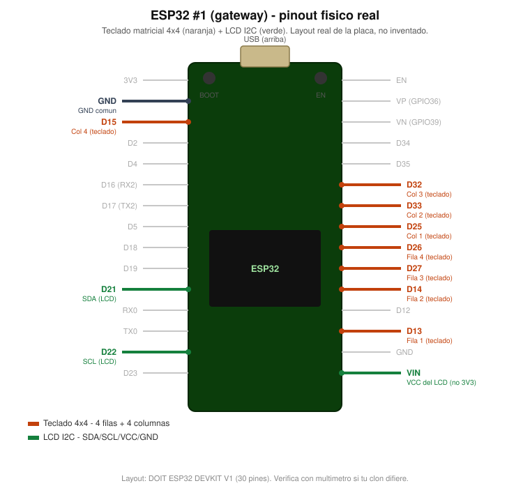

# Conexiones — ESP32 #1 (gateway)

Teclado matricial 4x4 + LCD I2C. Es la única placa con WiFi; se alimenta
por el USB de programación, nada aquí necesita fuente externa.

8 GPIO para el teclado (4 filas + 4 columnas, sin resistencias externas: las columnas usan pull-up interno) y 4 para el LCD por I2C. Ningún componente de esta placa necesita fuente externa.

## Tabla de pines

| Señal | GPIO | Notas |
|---|---|---|
| Teclado — Fila 1 | 13 | `OUTPUT` |
| Teclado — Fila 2 | 14 | `OUTPUT` |
| Teclado — Fila 3 | 27 | `OUTPUT` |
| Teclado — Fila 4 | 26 | `OUTPUT` |
| Teclado — Columna 1 | 25 | `INPUT_PULLUP` |
| Teclado — Columna 2 | 33 | `INPUT_PULLUP` |
| Teclado — Columna 3 | 32 | `INPUT_PULLUP` |
| Teclado — Columna 4 | 15 | `INPUT_PULLUP` |
| LCD — SDA | 21 | I2C, mismo bus que usará el TCS3472 en el otro ESP32 (Bloque 2) |
| LCD — SCL | 22 | I2C |
| LCD — VCC | `VIN` | El pin de 5V del devkit (serigrafiado `VIN`), no `3V3` |
| LCD — GND | GND | |

Coincide exactamente con `pinesFilas`/`pinesColumnas` y `LiquidCrystal_I2C lcd(0x27, 16, 2)`
en [`firmware/esp32-gateway/src/main.cpp`](../firmware/esp32-gateway/src/main.cpp).
Si tu módulo LCD no responde, probá la dirección `0x3F` (la otra dirección común de estos backpacks).

## Notas de armado

- El teclado no lleva resistencias: las 4 columnas usan el pull-up interno
  del ESP32 (`INPUT_PULLUP`), así que alcanza con 8 cables al teclado, nada más.
- El LCD sí necesita alimentación: tomala del pin `VIN` del devkit (el de
  5V), no del `3V3` — a 3.3V el backlight queda muy tenue o no prende.
- Este ESP32 es el único que lleva antena activa por software (`WiFi.begin`).
  Anotá el canal que imprime por Serial al conectar (`WiFi.channel()`): el
  ESP32 #2 lo necesita para sincronizar ESP-NOW — ver
  [`conexiones-esp32-sorter.md`](./conexiones-esp32-sorter.md).

El diagrama de arriba marca la posición real de cada pin sobre el layout
físico de una DOIT ESP32 DEVKIT V1 (30 pines) — el mismo modelo y la misma
plantilla que `esp32-potenciometro-led/docs/img/esp32-pinout-fisico.svg`.
Referencia completa, sin resaltar nada, en
[`img/esp32-pinout-fisico.svg`](./img/esp32-pinout-fisico.svg).
