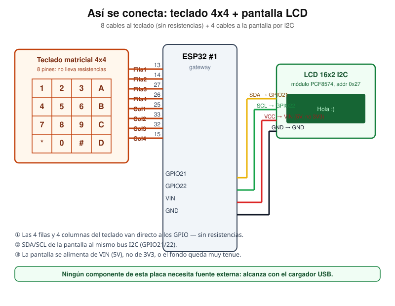
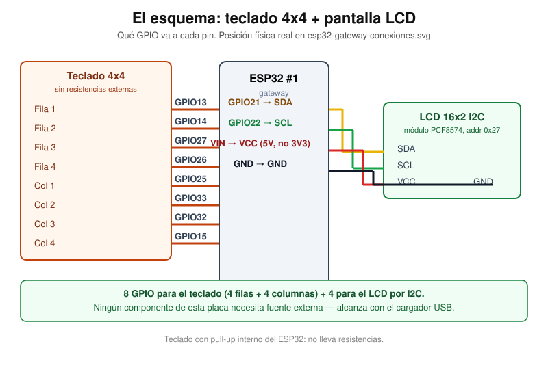
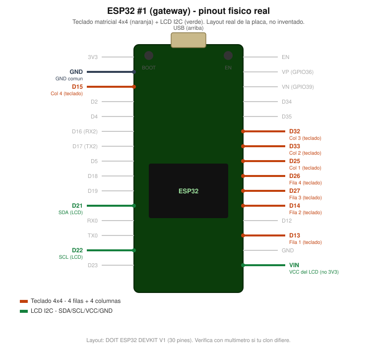
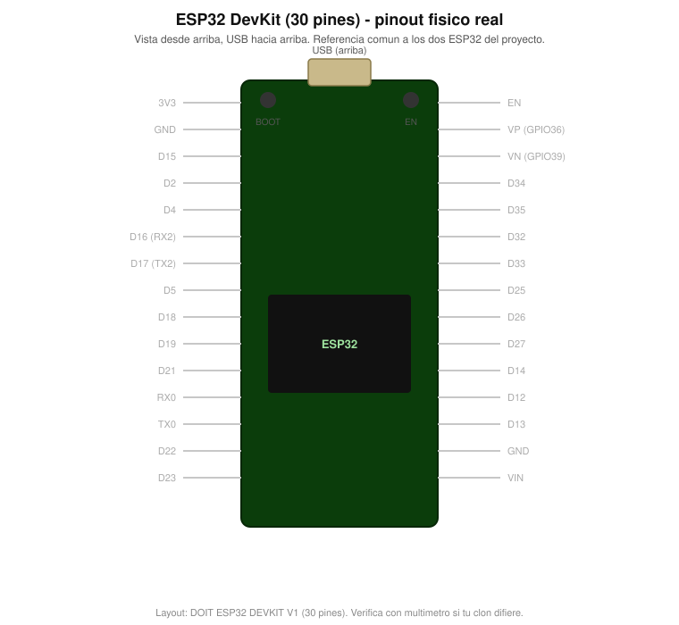
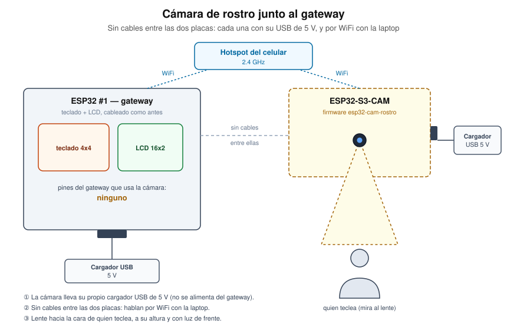

# Conexiones — ESP32 #1 (gateway)

Teclado matricial 4x4 + LCD I2C. Es la única placa con WiFi (de las dos del sistema base; la cámara opcional, más abajo, tiene el suyo); se alimenta
por el USB de programación, nada aquí necesita fuente externa.

8 GPIO para el teclado (4 filas + 4 columnas, sin resistencias externas: las columnas usan pull-up interno) y 4 para el LCD por I2C. Ningún componente de esta placa necesita fuente externa.

## Tabla de pines

| Señal               | GPIO  | Notas                                                           |
| ------------------- | ----- | --------------------------------------------------------------- |
| Teclado — Fila 1    | 13    | `OUTPUT`                                                        |
| Teclado — Fila 2    | 14    | `OUTPUT`                                                        |
| Teclado — Fila 3    | 27    | `OUTPUT`                                                        |
| Teclado — Fila 4    | 26    | `OUTPUT`                                                        |
| Teclado — Columna 1 | 25    | `INPUT_PULLUP`                                                  |
| Teclado — Columna 2 | 33    | `INPUT_PULLUP`                                                  |
| Teclado — Columna 3 | 32    | `INPUT_PULLUP`                                                  |
| Teclado — Columna 4 | 15    | `INPUT_PULLUP`                                                  |
| LCD — SDA           | 21    | I2C, mismo bus que usará el TCS3472 en el otro ESP32 (Bloque 2) |
| LCD — SCL           | 22    | I2C                                                             |
| LCD — VCC           | `VIN` | El pin de 5V del devkit (serigrafiado `VIN`), no `3V3`          |
| LCD — GND           | GND   |                                                                 |

Coincide exactamente con `pinesFilas`/`pinesColumnas` y `LiquidCrystal_I2C lcd(0x27, 16, 2)`
en [`firmware/esp32-gateway/src/main.cpp`](../firmware/esp32-gateway/src/main.cpp).
La dirección I2C del LCD depende del módulo físico soldado (puede ser `0x27`
o `0x3F` según la variante del chip PCF8574) — **reescaneala cada vez que
cambies de módulo**, no asumas que es la misma. `main.cpp` ya trae un
escáner I2C en `setup()` que la reporta por Serial, o usá el sketch aparte
[`firmware/lcd-test/`](../firmware/lcd-test/) para probar el LCD solo, sin
esperar a que conecte WiFi/MQTT.

## Uso del teclado

| Tecla   | Hace                                                             |
| ------- | ----------------------------------------------------------------- |
| `0`-`9` | Agrega un dígito al PIN (máximo 8)                                 |
| `D`     | Borra el último dígito escrito                                    |
| `*`     | Borra todo el PIN y reinicia el conteo de intentos                 |
| `#`     | Envía el PIN al servidor (`planta/login/intento`)                  |
| `A B C` | Sin uso                                                            |

Cualquier tecla saca al LCD del mensaje que esté mostrando (el resultado de
un login, la última caja contada) y **además se procesa**: si es un dígito,
ya cuenta como el primero del PIN. Mientras arranca (I2C, WiFi, MQTT) el
LCD no se actualiza: se queda en "Conectando WiFi" durante 10-15 s sin que
eso signifique que se colgó.

### Qué muestra el LCD cuando pasa una caja

Color arriba y conteo abajo (`Azul` / `3`); cuando esa caja cierra el lote,
`5 Lote completo!`. Se queda así hasta la próxima caja o la próxima tecla.
Si alguien está a mitad de un PIN o esperando el resultado del login, la
caja no interrumpe (se ve igual en el dashboard).

### Problemas comunes del teclado

- **Una tecla registra dos o más pulsaciones por una sola presionada**:
  `setup()` sube el antirrebote a 120ms (`teclado.setDebounceTime`, default
  de la librería Keypad: 10ms). Si con eso alcanza, listo. Si **solo una
  tecla puntual** sigue duplicando y las demás de su misma fila/columna
  andan bien, no es el cableado: es el contacto/membrana de esa tecla en
  particular (probar limpiándola con alcohol isopropílico; si no mejora, es
  desgaste de fábrica). La tecla `D` sirve para corregir el dígito de más
  mientras tanto.
- **Una fila o columna entera no responde**: ahí sí es el cable de ese
  GPIO (ver tabla de pines arriba) — revisar continuidad y las soldaduras.
- Para diagnosticar cuál es el caso, el monitor serie (`pio device monitor`,
  115200) imprime `Tecla detectada: 'x'` por cada pulsación que ve la
  librería, aunque `manejarTeclado()` la ignore.

### Problemas comunes del LCD

- **Sin texto, con o sin luz de fondo**: primero el potenciómetro de
  contraste del propio módulo I2C (un trimmer pequeño, normalmente azul,
  junto al chip PCF8574) — gíralo muy despacio, la ventana legible suele
  ser angosta y pegada a un extremo.
- **Bloques negros sólidos en una línea, la otra vacía**: esto **no** es un
  fallo de cableado — es contraste demasiado alto saturando los caracteres
  reales que el firmware sí está escribiendo bien (la línea vacía lo está
  porque el código no le manda texto en ese momento, no porque algo esté
  roto). Bajar el contraste con el trimmer.
- **El trimmer no cambia nada al girarlo** (mismo resultado en todo su
  rango): el potenciómetro está roto o mal conectado. Se puede saltear
  poniendo una resistencia entre el pin `V0` del LCD y VCC o GND según haga
  falta subir o bajar el contraste (ver historial de commits de este
  archivo para más detalle de cómo se diagnosticó).

## Notas de armado

- El teclado no lleva resistencias: las 4 columnas usan el pull-up interno
  del ESP32 (`INPUT_PULLUP`), así que alcanza con 8 cables al teclado, nada más.
- El LCD sí necesita alimentación: tomala del pin `VIN` del devkit (el de
  5V), no del `3V3` — a 3.3V el backlight queda muy tenue o no prende.
- Este ESP32 es el único que lleva antena activa por software (`WiFi.begin`).
  Anotá el canal que imprime por Serial al conectar (`WiFi.channel()`): el
  ESP32 #2 lo necesita para sincronizar ESP-NOW — ver
  [`conexiones-esp32-sorter.md`](./conexiones-esp32-sorter.md).

## Dónde está cada pin en la placa física real

El esquemático de arriba es lógico (qué componente va a qué GPIO); para
encontrar cada pin sobre la placa real, este otro diagrama marca la
posición física exacta en una DOIT ESP32 DEVKIT V1 (30 pines) — el mismo
modelo y la misma plantilla que
`esp32-potenciometro-led/docs/img/esp32-pinout-fisico.svg`:

Referencia completa sin resaltar nada:

## Cámara de rostro (opcional)

La versión A de la cámara (login por PIN + rostro) va **junto a este gateway**,
pero **no se cablea a él**: es una placa aparte con su propio USB de 5 V, y se
coordinan por WiFi a través de la laptop.

| Qué                       | Cómo                                                                        |
| ------------------------- | --------------------------------------------------------------------------- |
| Pines del gateway que usa | **Ninguno** (el cableado de arriba no cambia)                               |
| Alimentación de la cámara | Su propio cargador USB de 5 V, no el gateway                                |
| Comunicación              | WiFi 2.4 GHz a la laptop: MQTT :1883 (órdenes) y HTTP :8000 (foto)          |
| Firmware                  | [`firmware/esp32-cam-rostro/`](../firmware/esp32-cam-rostro/)               |
| `config.h` de la cámara   | `WIFI_SSID`, `WIFI_PASSWORD`, `MQTT_HOST`, `API_URL`, `CAMARA_TOKEN`        |
| Dónde ponerla             | Junto al teclado, a la altura de la cara de quien teclea, con luz de frente |

El gateway solo cambia en el firmware: muestra "Mire la camara" y "Rostro no
valido" en el LCD. Flujo completo, IA y puesta en marcha en
[`camara-rostro.md`](./camara-rostro.md); esquema de red en
[`camara-conexion-red.svg`](img/camara-conexion-red.svg).
