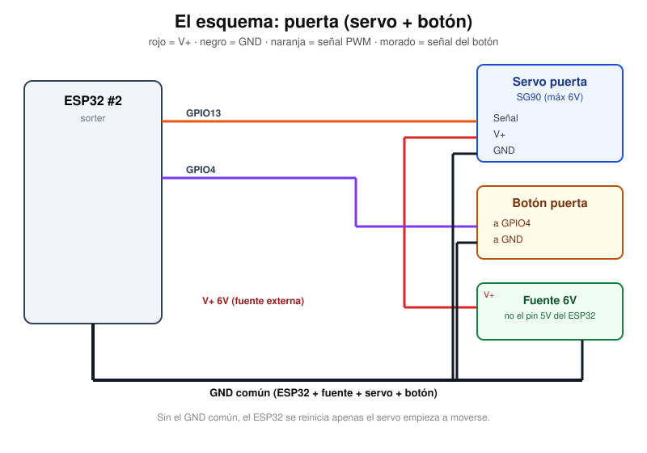
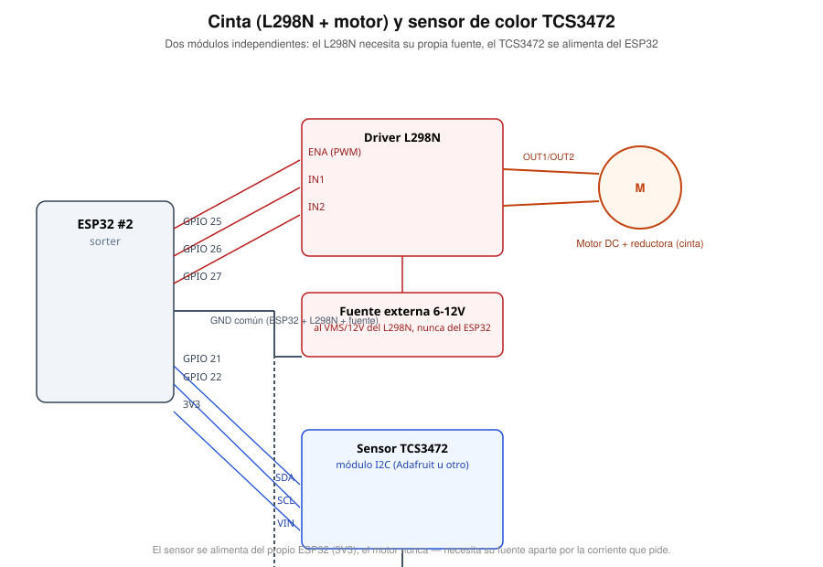
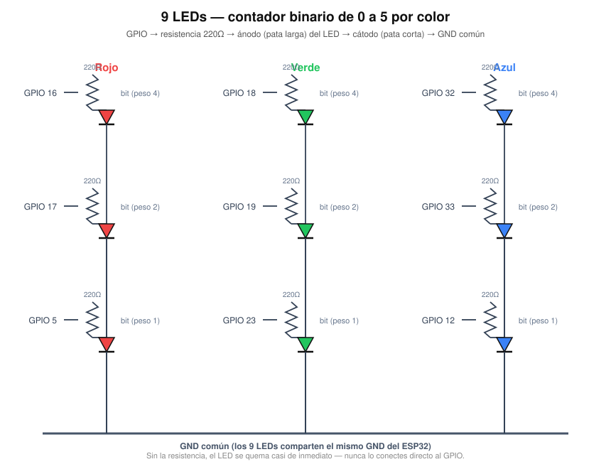
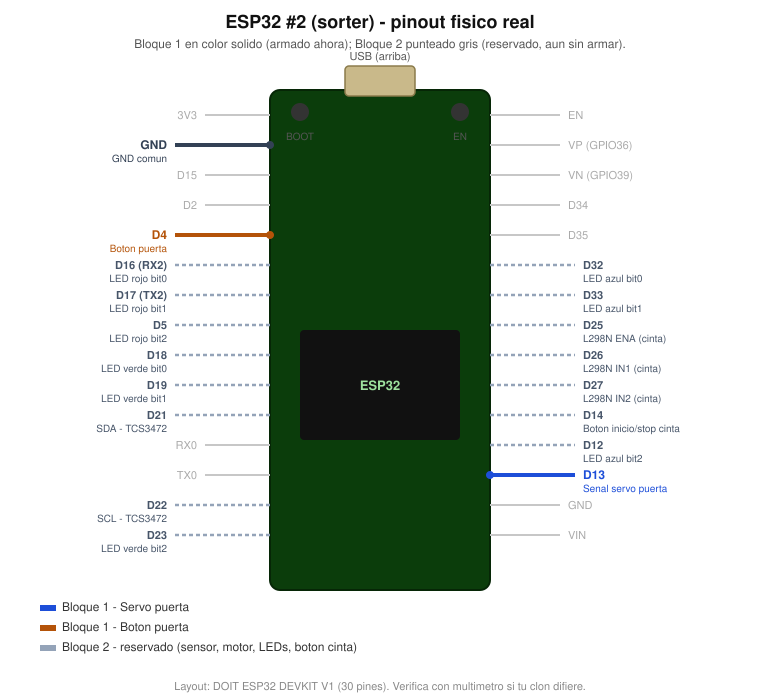
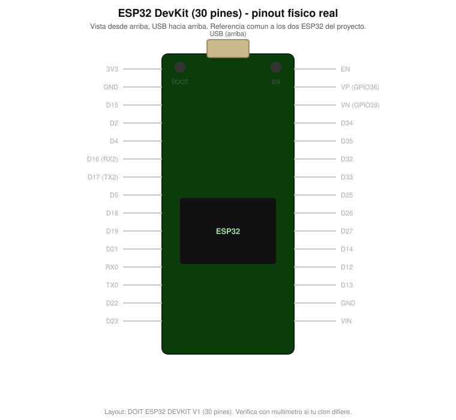
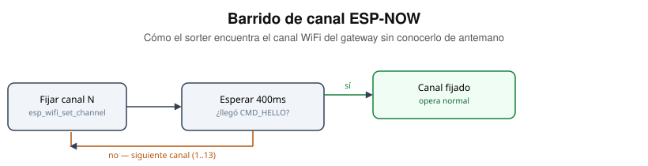

# Conexiones — ESP32 #2 (sorter)

Servo de la puerta, botón, cinta (motor DC + L298N), sensor de color
TCS3472 y los 9 LEDs del contador binario. Sin WiFi — solo ESP-NOW.

## Puerta y botón (Bloque 1)

La señal del servo (GPIO13) y el botón (GPIO4) van directo al ESP32, pero
servo, botón, fuente externa y ESP32 comparten un único GND. Sin ese cable
de tierra común, el ESP32 se reinicia apenas el servo empieza a moverse —
ver "Por qué la fuente externa" más abajo.

| Señal | GPIO | Notas |
|---|---|---|
| Servo — Señal | 13 | PWM, `Servo.attach(13)` (librería ESP32Servo) |
| Servo — V+ | — | Fuente externa 5-12V, **no** el pin 5V del ESP32 |
| Servo — GND | — | Al GND común |
| Botón puerta | 4 | `INPUT_PULLUP`, antirrebote 40ms en firmware — no lleva resistencia externa |

Coincide con `PIN_SERVO_PUERTA` y `PIN_BOTON_PUERTA` en
[`firmware/esp32-sorter/src/main.cpp`](../firmware/esp32-sorter/src/main.cpp).

### Por qué la fuente externa (y por qué falla si no la pones)

El pin `5V` del ESP32 DevKit sale del regulador del propio USB, pensado para
unos pocos cientos de mA. Un servo bajo carga puede pedir picos de 500mA–1A
al arrancar a moverse. Si lo alimentás desde ahí, la caída de tensión
reinicia el ESP32 justo cuando el servo se mueve — el síntoma clásico es
"se reinicia solo al abrir la puerta". La fuente externa evita ese pico; el
**GND común es obligatorio** porque la señal PWM del ESP32 necesita una
referencia de tierra compartida con el servo para que el ángulo se
interprete bien.

## Cinta (L298N + motor) y sensor de color (Bloque 2)

| Señal | GPIO | Notas |
|---|---|---|
| L298N — ENA | 25 | PWM (`ledcAttachPin`), controla la velocidad |
| L298N — IN1 | 26 | Dirección, fija en `HIGH` en el firmware (un solo sentido de giro) |
| L298N — IN2 | 27 | Dirección, fija en `LOW` |
| L298N — VMS / 12V | — | Fuente externa 6-12V (la del motor), **no** el ESP32 |
| L298N — GND | — | Al GND común (ESP32 + fuente + L298N) |
| Motor — OUT1 / OUT2 | — | A los dos bornes del motor, no importa cuál va a cuál (si gira al revés, se invierten) |
| TCS3472 — SDA | 21 | I2C, mismo bus que usa el LCD del gateway (son placas distintas, no hay conflicto) |
| TCS3472 — SCL | 22 | I2C |
| TCS3472 — VIN | 3V3 | El sensor sí se alimenta del propio ESP32 — a diferencia del motor, consume poquísimo |
| TCS3472 — GND | — | Al mismo GND común |
| Botón inicio/stop cinta | 14 | `INPUT_PULLUP`, alterna off↔low; "full" solo por comando remoto |

Coincide con `PIN_MOTOR_ENA/IN1/IN2`, `PIN_BOTON_CINTA` y la inicialización
de `Adafruit_TCS34725` en
[`firmware/esp32-sorter/src/main.cpp`](../firmware/esp32-sorter/src/main.cpp).

**El motor nunca se alimenta del ESP32** — el L298N sí puede sacarle unos
2A a la fuente en el arranque, muy por encima de lo que el regulador del
devkit aguanta. El sensor es la excepción: un TCS3472 consume miliamperios,
así que su `VIN` va directo al `3V3` del ESP32 sin problema.

## Los 9 LEDs — contador binario (Bloque 2)

| Color | GPIO (peso 4 / 2 / 1) |
|---|---|
| Rojo | 16, 17, 5 |
| Verde | 18, 19, 23 |
| Azul | 32, 33, 12 |

Cada LED lleva su propia resistencia de **220Ω en serie**, entre el GPIO y
el ánodo (pata larga) del LED — nunca el LED solo. El cátodo (pata corta,
o el lado con el borde plano en la carcasa) va al GND común. Sin la
resistencia el LED tira mucha más corriente de la que el GPIO puede dar y
se quema en segundos.

`mostrarContador()` en el firmware enciende los 3 LEDs de un color como un
número binario de 0 a 5: el de peso 4 es el bit más significativo, el de
peso 1 el menos significativo. Por ejemplo, 5 cajas = `101` = LEDs de peso
4 y 1 encendidos, el de peso 2 apagado — es la tabla `L1 L2 L3` de la
pizarra.

## Dónde está cada pin en la placa física real

Entre el Bloque 1 y el Bloque 2 este ESP32 usa 17 de sus 30 pines físicos —
por eso, además de los esquemáticos de arriba (qué componente va a qué
pin), vale la pena ver la posición real en la placa: al armar a mano es
fácil confundir un pin cercano por otro. El firmware del Bloque 2 ya está
escrito y compilado; lo que falta es cablearlo — por eso sigue marcado en
gris punteado, para distinguirlo de un vistazo del Bloque 1 (ya armado y
probado con hardware pendiente de flashear):

Referencia completa (sin resaltar nada):

## Cómo el sorter encuentra el canal del gateway

Esta placa no se conecta a ningún WiFi, así que no tiene forma de saber de
antemano en qué canal quedó el gateway al conectarse al router. Lo resuelve
barriendo canales al arrancar:

Peor caso: 13 canales × 400ms ≈ 5.2s hasta sincronizar. El gateway manda su heartbeat CMD_HELLO cada segundo apenas conecta al WiFi, así que en la práctica es casi siempre más rápido.

Implementado en `barrerCanalSiHaceFalta()` dentro de
[`firmware/esp32-sorter/src/main.cpp`](../firmware/esp32-sorter/src/main.cpp).
Limitación conocida: si el gateway se reconecta a un canal distinto después
de que el sorter ya sincronizó, no hay reintento automático — hay que
reiniciar el sorter. Aceptable para una demo de examen, no para producción.
