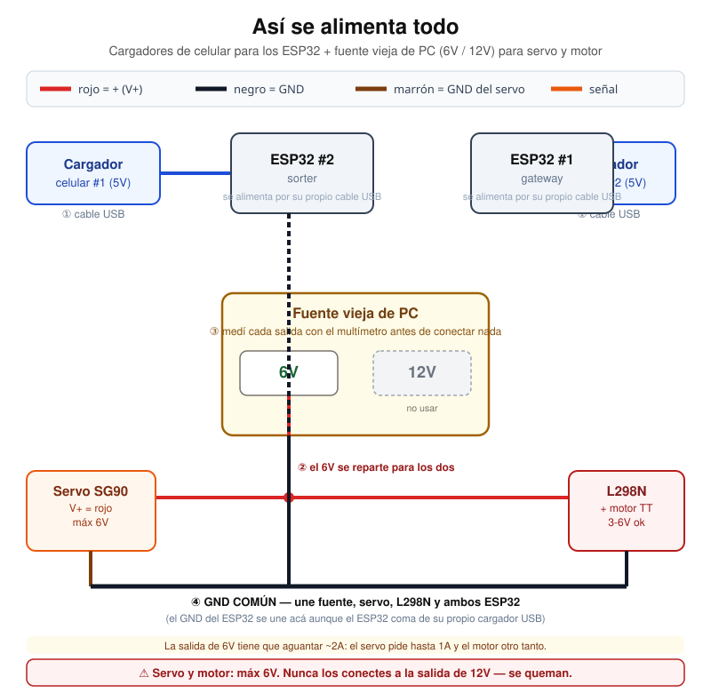
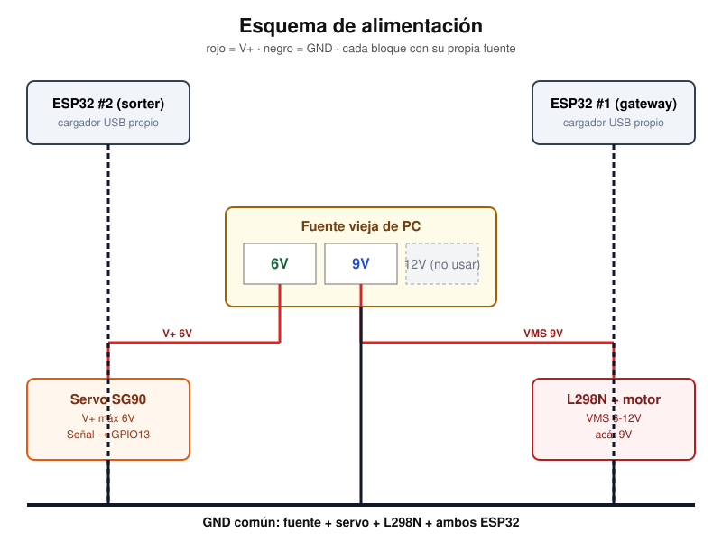
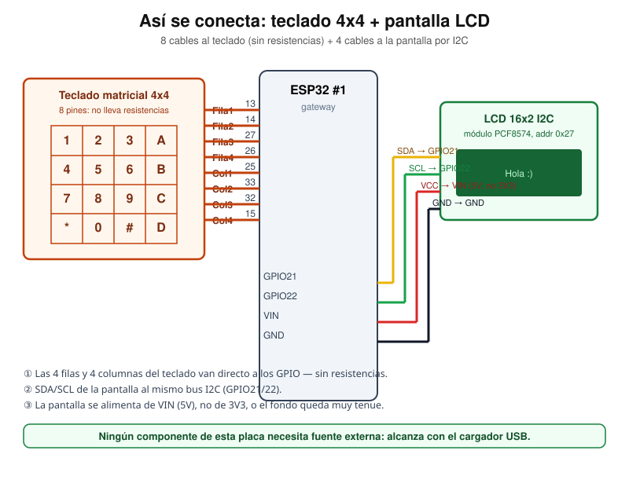
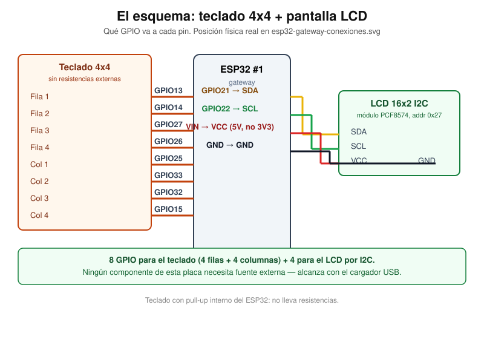
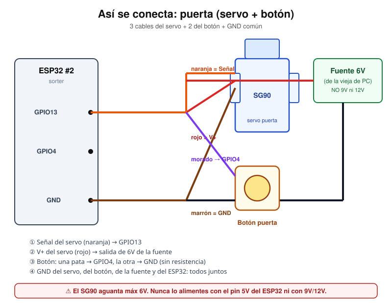
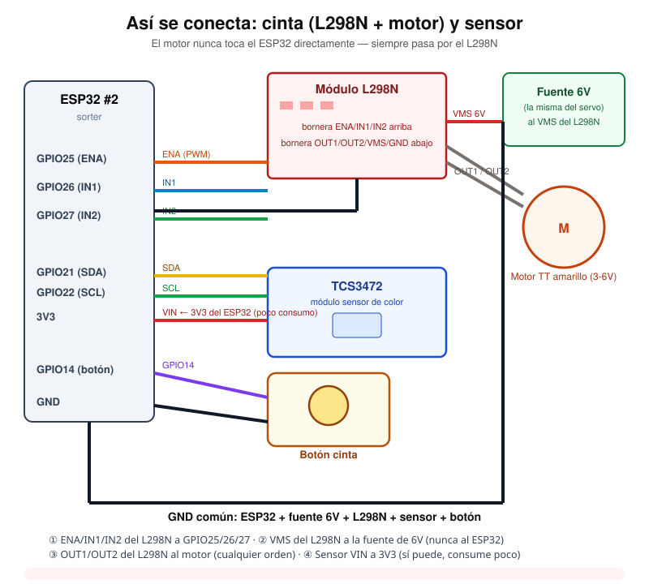
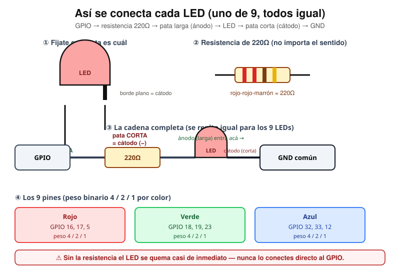

# Guía de armado completo

Todos los componentes de las dos placas, en una sola página, en el orden
en que conviene cablearlos. Cada diagrama tiene su propia página con más
contexto ([`conexiones-esp32-gateway.md`](./conexiones-esp32-gateway.md),
[`conexiones-esp32-sorter.md`](./conexiones-esp32-sorter.md)) — esta es la
versión "todo junto" para armar de corrido sin saltar entre páginas.

## Antes de empezar

- **2 ESP32 distintos.** El gateway (teclado + LCD) y el sorter (servo,
  motor, sensor, LEDs) son placas separadas — no comparten cables entre sí,
  solo se "hablan" por WiFi/ESP-NOW una vez programadas.
- **Una fuente externa con salida de 6V**, no sale del ESP32:
  - Servo puerta: **4.8-6V** (el SG90 se quema arriba de 6V)
  - Motor + L298N: el motor es un TT amarillo, rateado 3-6V
  - El servo y el motor van **los dos a la misma salida de 6V** de la
    fuente vieja de PC (que solo tiene 6V y 12V, no 9V) — esa salida tiene
    que aguantar los dos consumos juntos, unos 2A en total.
  - **Nunca** conectes servo ni motor a la salida de 12V, y **nunca** el
    pin `5V`/`VIN` del ESP32.
  - Ambos ESP32 se alimentan aparte, por su propio cargador de celular
    (5V USB).
- **GND común obligatorio** en cada placa: ESP32 + su(s) fuente(s) externa(s)
  - todo lo que alimenten esas fuentes comparten un mismo GND, aunque el
    ESP32 coma de un cargador USB distinto.

---

## ESP32 #1 — gateway

### Teclado 4x4 + LCD I2C

| Señal               | GPIO  | Notas                   |
| ------------------- | ----- | ----------------------- |
| Teclado — Fila 1    | 13    | `OUTPUT`                |
| Teclado — Fila 2    | 14    | `OUTPUT`                |
| Teclado — Fila 3    | 27    | `OUTPUT`                |
| Teclado — Fila 4    | 26    | `OUTPUT`                |
| Teclado — Columna 1 | 25    | `INPUT_PULLUP`          |
| Teclado — Columna 2 | 33    | `INPUT_PULLUP`          |
| Teclado — Columna 3 | 32    | `INPUT_PULLUP`          |
| Teclado — Columna 4 | 15    | `INPUT_PULLUP`          |
| LCD — SDA           | 21    | I2C                     |
| LCD — SCL           | 22    | I2C                     |
| LCD — VCC           | `VIN` | 5V del devkit, no `3V3` |
| LCD — GND           | GND   |                         |

Sin resistencias externas (el teclado usa pull-up interno). El LCD sí
necesita alimentación de `VIN`, no de `3V3`, o el backlight queda muy tenue.

### Dónde está cada pin en la placa real

---

## ESP32 #2 — sorter

### Puerta: servo + botón

| Señal         | GPIO | Notas                                             |
| ------------- | ---- | ------------------------------------------------- |
| Servo — Señal | 13   | PWM                                               |
| Servo — V+    | —    | Fuente externa a **6V** (SG90: 4.8-6V, nunca 12V) |
| Servo — GND   | —    | GND común                                         |
| Botón puerta  | 4    | `INPUT_PULLUP`, sin resistencia externa           |

### Cinta: motor + L298N, y sensor de color

| Señal                   | GPIO  | Notas                                        |
| ----------------------- | ----- | -------------------------------------------- |
| L298N — ENA             | 25    | PWM, velocidad                               |
| L298N — IN1             | 26    | Dirección (fija en el firmware)              |
| L298N — IN2             | 27    | Dirección                                    |
| L298N — VMS             | —     | Fuente externa a **6V** (la misma del servo) |
| L298N — GND             | —     | GND común                                    |
| Motor — OUT1/OUT2       | —     | A los bornes del motor, cualquier orden      |
| TCS3472 — SDA           | 21    | I2C                                          |
| TCS3472 — SCL           | 22    | I2C                                          |
| TCS3472 — VIN           | `3V3` | Sí sale del ESP32 (consume poco)             |
| TCS3472 — GND           | —     | GND común                                    |
| Botón inicio/stop cinta | 14    | `INPUT_PULLUP`, alterna off↔low              |

### Los 9 LEDs — contador binario

| Color | GPIO (peso 4 / 2 / 1) |
| ----- | --------------------- |
| Rojo  | 16, 17, 5             |
| Verde | 18, 19, 23            |
| Azul  | 32, 33, 12            |

Cada LED con su resistencia de **220Ω** entre el GPIO y el ánodo (pata
larga); el cátodo (pata corta) al GND común. 9 LEDs, 9 resistencias.

### Dónde está cada pin en la placa real

Bloque ya armado en color sólido, el resto en gris punteado — todo sobre
el layout físico real (DOIT ESP32 DEVKIT V1, 30 pines):

---

## Checklist antes de encender

- [ ] Teclado: 8 cables a filas/columnas, ninguno mezclado con los del sorter (son placas distintas)
- [ ] LCD: `VIN` (no `3V3`) + GND + SDA + SCL
- [ ] Servo: señal a GPIO13; V+ a la salida de **6V** (nunca 12V), GND a la fuente externa, **no** al ESP32
- [ ] Botón puerta: GPIO4 + GND (sin resistencia)
- [ ] Motor: OUT1/OUT2 del L298N; VMS del L298N a la misma salida de **6V** del servo, GND común
- [ ] L298N: ENA=25, IN1=26, IN2=27
- [ ] Sensor: SDA=21, SCL=22, VIN a `3V3`, GND común
- [ ] Botón cinta: GPIO14 + GND
- [ ] Los 9 LEDs: cada uno con su resistencia de 220Ω, ánodo hacia el GPIO, cátodo a GND común
- [ ] GND común verificado con multímetro (continuidad) entre ESP32, fuente(s) externa(s) y todos los módulos
- [ ] Ningún componente alimentado desde el pin `5V`/`VIN` del ESP32 salvo el LCD (que sí puede, consume poco)
- [ ] Cable USB de **datos** (no solo carga) en cada placa

## Referencia de todos los pines juntos

## Ver también

- [`arquitectura.md`](./arquitectura.md) — cómo se comunican las dos placas entre sí y con el servidor
- [`protocolo.md`](./protocolo.md) — qué manda cada placa una vez armada y flasheada
