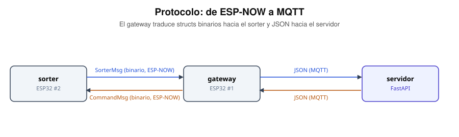

# Protocolo: ESP-NOW y MQTT

Los mensajes que efectivamente cruzan cada hop, con su forma real — no solo
los nombres de los topics.



El gateway es el traductor: structs binarios de tamaño fijo hacia el sorter, JSON hacia el servidor. Ningún otro nodo habla los dos idiomas.

## ESP-NOW — `firmware/shared/protocol.h`

### `SorterMsg` (#2 → #1)

```c
struct __attribute__((packed)) SorterMsg {
  uint8_t msg_type;      // 1=evento_caja 2=estado 3=alerta
  uint8_t color_id;      // 0=rojo 1=verde 2=azul 3=desconocido
  uint16_t r, g, b, c;   // lectura cruda TCS3472
  uint8_t count_r, count_g, count_b;  // contador binario 0-5 de cada color
  uint8_t lote_completo; // 1 si este evento cerró un lote de 5
  uint8_t motor_state;   // 0=off 1=low 2=full
  uint8_t door_open;
  uint32_t ts_ms;
};
```

El struct se definió completo desde el Bloque 1 (motor, color, conteos en
0) para no tener que tocarlo ni recompilar las dos placas a mitad de
camino; el Bloque 2 solo empezó a llenar esos campos de verdad. El único
campo que se agregó recién en el Bloque 2 fue `lote_completo` — no estaba
previsto en el diseño original, hizo falta cuando el gateway necesitó
saber si un evento cerraba un lote sin tener que inferirlo comparando
contadores.

### `CommandMsg` (#1 → #2)

```c
struct __attribute__((packed)) CommandMsg {
  uint8_t cmd;   // 0=hello 1=start 2=stop 3=motor_speed 4=door 5=reset_counts
  uint8_t arg;
};
```

`CMD_HELLO` (0) no es un comando real: es el heartbeat que manda el gateway
cada segundo y que el sorter usa para el barrido de canal (ver
[`conexiones-esp32-sorter.md`](./conexiones-esp32-sorter.md)).

## MQTT — topics

| Topic | Dirección | Payload | Quién lo usa |
|---|---|---|---|
| `planta/login/intento` | ESP32 #1 → servidor | `{"pin": "1234", "intento": 1}` | Gateway publica al presionar `#` en el teclado |
| `planta/login/resultado` | servidor → ESP32 #1 | `{"exito": true, "nombre": "operador1", "bloqueado": false, "intento": 1}` | Servidor responde tras validar contra `usuarios` |
| `planta/sorter/estado` | ESP32 #1 → servidor | `{"puerta_abierta": true, "cinta_estado": "low"}` | Gateway reenvía lo que le llega por ESP-NOW; el servidor solo lo relay-ea por WebSocket, no lo persiste |
| `planta/sorter/evento` | ESP32 #1 → servidor | `{"color": "rojo", "conteo": 3, "lote_completo": false, "r": 900, "g": 200, "b": 180, "c": 1300}` | Cada caja que pasa por el sensor. `conteo` ya viene calculado por el ESP32 (Bloque 2) |
| `planta/sorter/alerta` | ESP32 #1 → servidor | `{"tipo": "...", "mensaje": "..."}` | Alertas del sorter fuera de `lote_completo` (que se deriva del evento). Sin uso todavía |
| `planta/cmd` | servidor → ESP32 #1 | `{"cmd": "puerta", "arg": 1}` · `{"cmd": "motor", "arg": 0\|1\|2}` · `{"cmd": "reset_counts"}` | Dashboard controla puerta/cinta o resetea los contadores (`POST /api/comandos`) |

`nombre` viene `null` cuando el PIN no corresponde a nadie; `bloqueado` es
`true` cuando el intento fallido es el número 2 — ahí el servidor también
inserta una fila en `alertas`. `lote_completo` en `planta/sorter/evento`
también inserta una fila en `alertas` (tipo `lote_completo`) y se
retransmite por WebSocket como evento aparte.

`cmd: "motor"` con `arg` 0/1/2 selecciona off/low/full directamente; el
botón físico del sorter solo alterna entre off y low (inicio/stop simple) —
"full" es exclusivamente remoto, desde el dashboard.

Probado de punta a punta con `mosquitto_pub`/`mosquitto_sub` antes de tener
hardware — ver el historial de commits de `server/app/mqtt_client.py`.

## Ver también

- [`arquitectura.md`](./arquitectura.md) — dónde corre cada pieza
- [`conexiones-esp32-gateway.md`](./conexiones-esp32-gateway.md)
- [`conexiones-esp32-sorter.md`](./conexiones-esp32-sorter.md)
