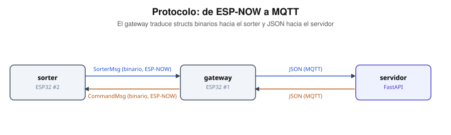

# Protocolo: ESP-NOW y MQTT

Los mensajes que efectivamente cruzan cada hop, con su forma real — no solo
los nombres de los topics.



El gateway es el traductor: structs binarios de tamaño fijo hacia el sorter, JSON hacia el servidor. Ningún otro nodo habla los dos idiomas.

## ESP-NOW — `firmware/shared/protocol.h`

### `SorterMsg` (#2 → #1)

```c
struct __attribute__((packed)) SorterMsg {
  uint8_t msg_type;      // 1=evento_caja 2=estado 3=alerta
  uint8_t color_id;      // 0=rojo 1=verde 2=azul 3=desconocido
  uint16_t r, g, b, c;   // lectura cruda TCS3472
  uint8_t count_r, count_g, count_b;  // contador binario 0-5 de cada color
  uint8_t lote_completo; // 1 si este evento cerró un lote de 5
  uint8_t motor_state;   // 0=off 1=low 2=full
  uint8_t door_open;
  uint32_t ts_ms;
};
```

El struct se definió completo desde el Bloque 1 (motor, color, conteos en 0) para no tener que tocarlo ni recompilar las dos placas a mitad de
camino; el Bloque 2 solo empezó a llenar esos campos de verdad. El único
campo que se agregó recién en el Bloque 2 fue `lote_completo` — no estaba
previsto en el diseño original, hizo falta cuando el gateway necesitó
saber si un evento cerraba un lote sin tener que inferirlo comparando
contadores.

### `CommandMsg` (#1 → #2)

```c
struct __attribute__((packed)) CommandMsg {
  uint8_t cmd;   // 0=hello 1=start 2=stop 3=motor_speed 4=door 5=reset_counts
  uint8_t arg;
};
```

`CMD_HELLO` (0) no es un comando real: es el heartbeat que manda el gateway
cada segundo y que el sorter usa para el barrido de canal (ver
[`conexiones-esp32-sorter.md`](./conexiones-esp32-sorter.md)).

## MQTT — topics

| Topic                                       | Dirección           | Payload                                                                                           | Quién lo usa                                                                                                                                                                                                                                                           |
| ------------------------------------------- | ------------------- | ------------------------------------------------------------------------------------------------- | ---------------------------------------------------------------------------------------------------------------------------------------------------------------------------------------------------------------------------------------------------------------------- |
| `planta/login/intento`                      | ESP32 #1 → servidor | `{"pin": "1234", "intento": 1}`                                                                   | Gateway publica al presionar `#` en el teclado                                                                                                                                                                                                                         |
| `planta/login/resultado`                    | servidor → ESP32 #1 | `{"exito": true, "nombre": "operador1", "bloqueado": false, "intento": 1}`                        | Servidor responde tras validar contra `usuarios`                                                                                                                                                                                                                       |
| `planta/sorter/estado`                      | ESP32 #1 → servidor | `{"puerta_abierta": true, "cinta_estado": "low"}`                                                 | Gateway reenvía lo que le llega por ESP-NOW; el servidor solo lo relay-ea por WebSocket, no lo persiste                                                                                                                                                                |
| `planta/sorter/evento`                      | ESP32 #1 → servidor | `{"color": "rojo", "conteo": 3, "lote_completo": false, "r": 900, "g": 200, "b": 180, "c": 1300}` | Cada caja que pasa por el sensor. `conteo` ya viene calculado por el ESP32 (Bloque 2)                                                                                                                                                                                  |
| `planta/sorter/alerta`                      | ESP32 #1 → servidor | `{"tipo": "...", "mensaje": "..."}`                                                               | Alertas del sorter fuera de `lote_completo` (que se deriva del evento). Sin uso todavía                                                                                                                                                                                |
| `planta/camara/rostro`                      | servidor → cámara   | `{"modo": "verificar"\|"enrolar", "usuario_id": 1}`                                               | Versión A: le ordena a la ESP32-S3-CAM verificar o enrolar una cara. Ver [`camara-rostro.md`](./camara-rostro.md)                                                                                                                                                      |
| `planta/camara/capturar`                    | servidor → cámara   | `{"evento_id": 42}`                                                                               | Versión B: foto de la caja que acaba de detectar el sensor. Solo con `CAMARA_COLOR=true`. Ver [`camara-color.md`](./camara-color.md)                                                                                                                                   |
| `planta/camara/estado/rostro` y `.../color` | cámara → servidor   | `{"version": "rostro", "online": true}`                                                           | Saludo **retenido** al conectarse; el broker publica `online: false` solo si la placa se cae (last will). El servidor solo activa una versión si hay una cámara de ese firmware conectada. Ver [`camara-rostro.md`](./camara-rostro.md#si-la-camara-no-esta-conectada) |
| `planta/cmd`                                | servidor → ESP32 #1 | `{"cmd": "puerta", "arg": 1}` · `{"cmd": "motor", "arg": 0\|1\|2}` · `{"cmd": "reset_counts"}`    | Dashboard controla puerta/cinta o resetea los contadores (`POST /api/comandos`)                                                                                                                                                                                        |

`planta/login/resultado` puede traer dos campos más cuando el login por
rostro está activo (`LOGIN_ROSTRO=true`): `"requiere_rostro": true` (PIN
correcto, falta la cara: el LCD muestra "Mire la camara" y el gateway sigue
esperando el resultado final) y `"motivo": "rostro"` (el intento falló por la
cara, no por el PIN). Con la variable apagada ninguno de los dos aparece.

`nombre` viene `null` cuando el PIN no corresponde a nadie; `bloqueado` es
`true` cuando el intento fallido es el número 2 — ahí el servidor también
inserta una fila en `alertas`. `lote_completo` en `planta/sorter/evento`
también inserta una fila en `alertas` (tipo `lote_completo`) y se
retransmite por WebSocket como evento aparte.

`cmd: "motor"` con `arg` 0/1/2 selecciona off/low/full directamente; el
botón físico del sorter cicla por los 3 estados en el mismo orden
(off → low → full → off), así que cualquiera de los dos caminos —botón
físico o comando remoto— llega a los mismos tres estados. El comando
remoto puede pisar el estado del botón en cualquier momento.

Probado de punta a punta con `mosquitto_pub`/`mosquitto_sub` antes de tener
hardware — ver el historial de commits de `server/app/mqtt_client.py`.

## HTTP — la cámara

Una foto no entra en un paquete ESP-NOW (250 bytes) ni en el buffer de
PubSubClient (256 bytes), así que la ESP32-S3-CAM manda los JPEG por HTTP
directo al servidor. Se autentican con el header `X-Camara-Token` (el JWT es
para el dashboard). El cuerpo es el JPEG crudo, con `Content-Type: image/jpeg`.

| Endpoint                                | Versión | Respuesta                                                                      |
| --------------------------------------- | ------- | ------------------------------------------------------------------------------ |
| `POST /api/rostro/verificar?usuario_id` | A       | `{"listo": false\|true, "exito": bool, "similitud": 0.92}`                     |
| `POST /api/rostro/muestra?usuario_id`   | A       | `{"ok": true, "muestras": 3}` o `{"ok": false, "motivo": "sin_rostro"}`        |
| `POST /api/color/captura?evento_id`     | B       | `{"evento_id", "color_sensor", "color_ia", "confianza", "coincide", "imagen"}` |

`listo: true` le dice a la cámara que deje de mandar fotos.

## Ver también

- [`arquitectura.md`](./arquitectura.md) — dónde corre cada pieza
- [`servidor.md`](./servidor.md) — endpoints REST que exponen estos mismos datos
- [`conexiones-esp32-gateway.md`](./conexiones-esp32-gateway.md)
- [`conexiones-esp32-sorter.md`](./conexiones-esp32-sorter.md)
- [`camara-rostro.md`](./camara-rostro.md) y [`camara-color.md`](./camara-color.md) — la ESP32-S3-CAM
